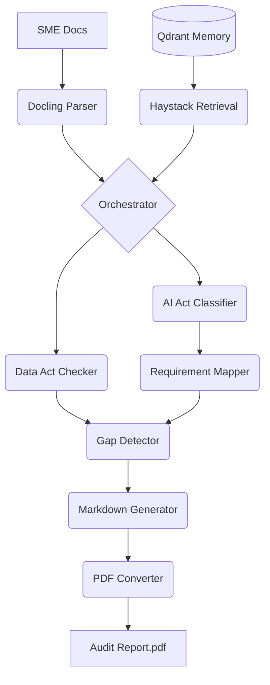

# SME AI Auditor - Architecture Guide

## Overview
The SME AI Auditor is a Production-Ready compliance pipeline designed for the **EU AI Act** and **Data Act (2026)**. 

Following a "Modular Intelligence" philosophy:
- **The Brain**: Mistral AI (Large 3) provides the high-level legal reasoning and audit logic.
- **The Memory**: Qdrant (Berlin-based) stores the localized regulatory statutes and SME context.
- **The Pilot (Goose)**: `src/main.py` functions as the **Executive Function**, coordinating when and how the Brain and Memory interact to produce a final verdict.

## High-Level Data Flow
1. **Ingestion**: `DoclingParser` extracts high-fidelity text from PDF/DOCX documentation.
2. **Memory**: `IndexManager` & `QdrantClientWrapper` manage the regulatory vector store (AI Act & Data Act statutes).
3. **Retrieval**: `DocumentRetrievalPipeline` (Haystack 2.x) fetches isolated legal context using Mistral Embeddings.
4. **Analysis**: 
   - `AIActClassifier` evaluates risk tiers and Article 5 "Red-Lines".
   - `DataActChecker` evaluates cloud-switching and sharing obligations.
5. **Synthesis**:
   - `RequirementMapper` maps risk to CEN/CENELEC 2026 standards.
   - `GapDetector` calculates the set difference between SME evidence and legal requirements.
6. **Reporting**: `MarkdownGenerator` and `PDFConverter` (WeasyPrint) produce immutable audit proofs.

## Component Map

## Memory Management (16GB Optimization)
The orchestrator (`src/main.py`) follows a **Strict Sequential Execution** pattern:
- **Phase 1**: Ingestion (Docling). Heavy memory usage. Object destroyed after text extraction.
- **Phase 2**: Retrieval & Reasoning (Mistral/Qdrant). Medium memory usage. Pipeline destroyed after classification.
- **Phase 3**: Reporting (WeasyPrint). Low memory usage.

## Observability & Sovereignty
- **Langfuse Integration**: Every audit run is traced with a unique `audit_trace_id`.
- **Trace Embedding**: The Trace ID is physically printed on every page of the PDF report, ensuring the "AI Reasoning Chain" can be audited by regulators at any time.
- **Deterministic Logic**: Temperature is locked at `0.1` for all legal assessments to ensure reproducibility.
