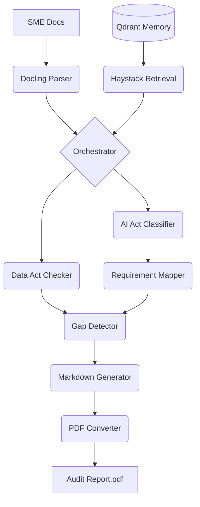

# SME AI Auditor - Architecture Guide

## Overview
The SME AI Auditor is a Production-Ready compliance pipeline designed for the **EU AI Act** and **Data Act (2026)**. 

Following a "Modular Intelligence" philosophy:
- **The Brain**: Mistral AI (Large 3) provides the high-level legal reasoning and audit logic.
- **The Memory**: Qdrant (Berlin-based) stores the localized regulatory statutes and SME context.
- **The Pilot (Web+Agent Orchestration)**: `src/web/app.py` is the HTTP/HTMX entry point handling user interactions, while `src/core/orchestrator.py` functions as the **Executive Function**, coordinating when and how the Brain and Memory interact to produce a final verdict.
## FastMCP & Agent Server Workflows
The compliance backend utilizes **FastMCP** (Server-Sent Events) to expose complex workflows as discoverable Model Context Protocol tools. 
- Located in `src/interfaces/mcp_server.py`, the FastMCP server is mounted directly into the FastAPI application.
- Autonomous agents (like Goose powered by Qwen 2.5-Coder) connect to this MCP server to execute delegated sub-tasks (e.g. data ingestion routines, querying Qdrant).
- This creates an iterative "Tool Request -> Server Execution -> Return" loop, achieving high autonomy.

## Web Dashboard (FastAPI + HTMX) and SSE Streaming
The front-end user experience avoids heavy single-page application frameworks by combining **Jinja2 templates** with **HTMX**.
- The main entry point `src/web/app.py` exposes a route `/audit/stream/{audit_id}`.
- This endpoint returns an `EventSourceResponse` representing an SSE stream. This architecture pipes status updates, findings, and logs directly from the backend Orchestrator generator to the frontend in real time.
- HTMX attributes (`hx-ext="sse"`, `sse-swap`) hook onto this channel, instantly updating the browser DOM dynamically.

## High-Level Data Flow
1. **Ingestion**: `DoclingParser` extracts high-fidelity text from PDF/DOCX documentation.
2. **Memory**: `IndexManager` & `QdrantClientWrapper` manage the regulatory vector store (AI Act & Data Act statutes).
3. **Retrieval**: `DocumentRetrievalPipeline` (Haystack 2.x) fetches isolated legal context using Mistral Embeddings.
4. **Analysis**: 
   - `AIActClassifier` evaluates risk tiers and Article 5 "Red-Lines".
   - `DataActChecker` evaluates cloud-switching and sharing obligations.
5. **Synthesis**:
   - `RequirementMapper` maps risk to CEN/CENELEC 2026 standards.
   - `GapDetector` calculates the set difference between SME evidence and legal requirements.
6. **Reporting**: `MarkdownGenerator` and `PDFConverter` (WeasyPrint) produce immutable audit proofs.

## Component Map

## Memory Management & Infrastructure (16GB Optimization)
The orchestrator (`src/core/orchestrator.py`) handles execution under tight machine restrictions:
- **Strict Sequential Execution**: 
  - **Phase 1**: Ingestion (Docling). Heavy memory usage. Object destroyed after text extraction.
  - **Phase 2**: Retrieval & Reasoning (Mistral/Qdrant). Medium memory usage. Pipeline destroyed after classification.
  - **Phase 3**: Reporting (WeasyPrint). Low memory usage.
- **Python Garbage Collection**: Manual/Explicit GC triggers are called after memory-heavy phases. We strongly favor bounded data structures like `deque(maxlen=N)` for array storage to prevent unchecked leaks.
- **Qdrant Constraints**: For deployments handling million+ vector schemas, Qdrant indices must be configured with `on_disk: true` (mmap) or use scalar quantization. This prevents the default RAM-loading behavior that might exceed target constraints.
- **Persistence**: 
  - Stateful user sessions are maintained by `AuditSessionManager`. By serializing session JSON payloads to local disk, audits survive asynchronous execution gaps or FastAPI interface reloads.
  - Docker containers operating Qdrant must mount physical host directories.

## Observability & Sovereignty
- **Langfuse Integration**: Every audit run is traced with a unique `audit_trace_id`.
- **Trace Embedding**: The Trace ID is physically printed on every page of the PDF report, ensuring the "AI Reasoning Chain" can be audited by regulators at any time.
- **Deterministic Logic**: Temperature is locked at `0.1` for all legal assessments to ensure reproducibility.
