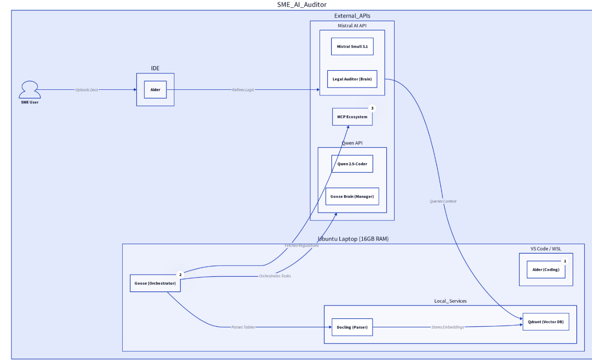

# The SME AI Auditor: Compliance-as-a-Service for the EU AI & Data Act (2026)



## 🚀 Project Overview

"The SME AI Auditor" is an automated **Compliance-as-a-Service** tool designed to assist Small and Medium-sized Enterprises (SMEs) in navigating the complex regulatory landscape of Artificial Intelligence in the European Union. By analyzing an SME's AI technical documentation, the tool generates a professional readiness report, identifying risk levels (Prohibited, High, Limited, Minimal) and pinpointing specific legal "gaps" against the **EU AI Act** and the **EU Data Act**.

This project is built upon a **Default Sovereign Tech Stack (2026)**, meticulously selected for its commitment to Data Sovereignty, Scalability, and Zero Licensing Fees (Open Source principles), with a strong emphasis on Finnish GDPR and Trust standards.

## 🎯 Mission & Vision

Our mission is to democratize AI compliance, making it accessible and manageable for SMEs. We envision a future where businesses can innovate with AI confidently, knowing their systems adhere to the highest ethical and legal standards set by the European Union, without incurring prohibitive costs or requiring specialized legal teams.

## ✨ Key Features

*   **Web-based Pilot Deck Dashboard**: Real-time audit streaming via FastAPI + HTMX with Server-Sent Events.
*   **Agentic MCP Toolbelt**: Goose/Qwen orchestrates audits via the Model Context Protocol, calling specialized tools atomically.
*   **Risk Level Classification**: Categorization of AI systems into Prohibited, High-Risk, Limited Risk, or Minimal Risk based on the EU AI Act.
*   **Legal Gap Detection**: Identification of specific non-compliance areas and actionable recommendations.
*   **Structured Reporting**: Generation of professional, auditable PDF reports with detailed findings, evidence, and legal reasoning.
*   **Data Sovereignty**: Built on an EU-centric, open-source technology stack ensuring data residency and compliance with GDPR.
*   **Dual-Act Compliance**: Comprehensive assessment against both the EU AI Act and the EU Data Act.

## 🛠️ Sovereign Tech Stack (2026)

Our technology stack is chosen to meet stringent requirements for data sovereignty, performance, and cost-effectiveness in the 2026 European context.

| Component | Default Choice | Why it's the "Best" for Finland / SME AI Auditor |
| :-------- | :------------- | :------------------------------------------------- |
| **Web Interface** | FastAPI + HTMX | Lightweight Pilot Deck with SSE streaming and zero-JS-bloat reactivity. |
| **Orchestrator** | Haystack 2.x | German-engineered. Best for modular, production-ready legal RAG pipelines. |
| **Vector DB** | Qdrant | Berlin-based. Optimized for EU data residency and complex metadata filtering. |
| **Inference Model (Auditor Brain)** | Mistral AI API (Mistral Large) | French-made. Top-tier reasoning for legal analysis, deterministic at temperature 0.1. |
| **Inference Model (Goose Brain)** | Qwen (Qwen3-Coder) | Optimized for agentic workflows and tool-calling via API, orchestrating the audit pipeline. |
| **Agentic Protocol** | FastMCP (MCP SDK) | Model Context Protocol server exposing atomic compliance tools to agent clients. |
| **Document Parser** | Docling (IBM Research) | Exceptional at reading complex tables found in EU AI Act Annexes and technical specs. Critical for accurate ingestion. |
| **Hosting** | Hetzner (Helsinki) | Keeps data physically on Finnish soil to satisfy Finnish GDPR/Trust standards. |
| **Observability** | LangFuse | Open-source tracing to prove how the AI reached its legal conclusions, crucial for auditability. |
| **Reporting** | WeasyPrint + Jinja2 | Industrial-grade HTML/MD to PDF conversion with professional templating. |

## ⚙️ Operational Workflow

The SME AI Auditor has evolved into a robust web-based application, providing a modern "Pilot Deck" Dashboard powered by **FastAPI and HTMX**. Audit processes are streamed in real-time to the browser via **Server-Sent Events (SSE)** without requiring heavy SPA frameworks.

1.  **Interaction (Pilot Deck UI)**: The user uploads technical documentation via the HTMX-powered dashboard. The web interface establishes a persistent SSE connection with the `src/web/app.py` stream endpoint.
2.  **Orchestration (FastMCP + Agents)**: The core system is anchored by a two-brain agent architecture:
    *   **Goose (Qwen3-Coder)** acts as the autonomous workflow orchestrator, utilizing our **FastMCP Server** (`src/interfaces/mcp_server.py`). The server exposes backend tools (data ingestion, vector search, dual-act audit), enabling agentic hand-off for subtasks.
    *   **Mistral AI (Mistral Large)** handles the heavy legal reasoning via structured JSON output with Pydantic validation.
3.  **Ingestion & Memory**: **Docling** parses the provided physical documents locally. The extracted text is vectorized using **Qdrant**, serving as the system's memory. Memory management processes actively clean and bound system state via Python garbage collection to optimize for 16GB environments.
4.  **Analysis**: The pipeline executes deterministic compliance checks: classifying risk, detecting gaps against CEN/CENELEC standards, and scanning against the EU AI/Data Acts.
5.  **Offline State Preservation**: `AuditSessionManager` explicitly serializes ongoing audit states to disk via JSON, guaranteeing process continuation even if the interface disconnects.
6.  **Reporting & Tracing**: All analysis steps output structured **Pydantic** objects which populate a polished **WeasyPrint** + HTML/Jinja2 audit PDF. End-to-end tracing is embedded locally via LangFuse, proving the reasoning behind every requirement gap.

## 🧠 Dual-Model AI Strategy

Our approach leverages a dual-model AI strategy to maximize efficiency and accuracy:

*   **Mistral Large (API)**: Serves as the primary "Auditor Brain" for nuanced **legal reasoning** and compliance analysis. Its strong performance in understanding complex legal texts makes it ideal for classification, requirement mapping, and gap detection against the EU AI Act and Data Act. Temperature is locked at `0.1` for deterministic legal assessment.
*   **Qwen3-Coder (API)**: Acts as the "Goose Brain" for **agentic workflows** and **orchestration**. Its superior tool-calling capabilities and proficiency in handling multi-step tasks enable Goose to efficiently manage the overall audit process, interact with MCP tools, and automate compliance tasks.

This separation of concerns ensures that each model is utilized for its optimal strength, leading to a more robust and reliable "Compliance-as-a-Service" solution.

## 🔌 MCP Agentic Interface

The FastMCP server (`src/interfaces/mcp_server.py`) exposes the following atomic tools for Goose and other MCP-compatible agents:

| Tool | Description | Privacy Guard |
| :--- | :---------- | :------------ |
| `heartbeat` | Pre-flight check — verifies Qdrant Memory Matrix is online. | N/A |
| `ingest_sme_evidence` | Parses SME documents via Docling. | Returns metadata receipt only — no raw text leaked to agent. |
| `perform_dual_act_audit` | Atomic AI Act + Data Act compliance analysis. | Uses `local_audit_id` for session isolation. |
| `ask_legal_reference` | Direct Qdrant search for Article citations. | Returns legal text for transparency "Why" questions. |

## 💡 Senior Implementation Pro-Tips (2026)

*   **Security Patching**: Always ensure `docling` is pinned to a patched release (`2.84.0+`) to mitigate known vulnerabilities like `CVE-2026-24009` (RCE vulnerability).
*   **Structured Output**: Utilize **Pydantic models** (as defined in `src/analysis/schemas.py`) for all AI outputs. This ensures strict data validation, type safety, and prevents downstream reporting errors, making the system more robust and auditable.
*   **Observability**: Implement **LangFuse `@observe()` decorators** around critical functions (e.g., `DoclingParser` and `DataActChecker` calls) to track the "cost per audit," performance metrics, and the AI's reasoning steps. This is vital for auditability and continuous optimization.
*   **Report Quality**: Replace basic PDF generation with **WeasyPrint** and **Jinja2**. This combination allows for highly customizable, professional-grade PDF reports with complex layouts, dynamic content, and branding, crucial for client-facing deliverables.

## 💻 Setup & Installation

This project is designed for an **Ubuntu laptop with 16GB of RAM**, leveraging API-based LLMs to minimize local resource consumption. We use `uv` for fast and robust Python package management.

### Prerequisites

*   Ubuntu Operating System
*   Python 3.12+
*   `curl` (for `uv` installation)
*   Docker (for Qdrant)

### 1. Install `uv`

`uv` is a modern, high-performance Python package installer and resolver. If you don't have it installed, run:

```bash
curl -LsSf https://astral.sh/uv/install.sh | sh
source $HOME/.cargo/env # Ensure uv is available in your current session
```

### 2. Clone the Repository

```bash
git clone https://github.com/<your-org-or-username>/sme_ai_auditor.git
cd sme_ai_auditor
```

### 3. Setup AI Companions & Environment

Run the setup script. This script will create a virtual environment, install project dependencies, and configure Aider and Goose.

```bash
chmod +x setup_ai_companions.sh
./setup_ai_companions.sh
```

### 4. Configure Environment Variables

Create a `.env` file in the project root with the following keys:

```dotenv
# --- SME AI Auditor: Sovereign Tech Stack Configuration ---

# 1. Inference Engine
MODEL_NAME=mistral-large-2512
MISTRAL_API_KEY=sk-your_mistral_api_key_here

# 2. Vector DB (Berlin-Sovereign)
QDRANT_URL=http://localhost:6333
QDRANT_COLLECTION_NAME=sme_ai_auditor_compliance

# 3. Document Parser (Secure & Lean)
DOCLING_PDF_BACKEND=pypdfium2
DOCLING_NUM_THREADS=1

# 4. Networking
PORT=9000

# 5. Observability (Auditability Requirement)
LANGFUSE_SECRET_KEY=REDACTED_LANGFUSE_KEY_key_here
LANGFUSE_PUBLIC_KEY=REDACTED_LANGFUSE_PUBLIC_key_here
LANGFUSE_BASE_URL=https://cloud.langfuse.com

# 6. AI Companions
AIDER_MODEL=mistral/devstral-2512
GOOSE_MODEL=qwen/qwen3-coder
GOOSE_MCP_SERVER_URL=http://localhost:9000/mcp
```

### 5. Start Qdrant (Docker)

```bash
docker run -d -p 6333:6333 -p 6334:6334 \
    -v $(pwd)/qdrant_storage:/qdrant/storage \
    qdrant/qdrant
```

### 6. Activate Virtual Environment

```bash
source .venv/bin/activate
```

### 7. Install Project Dependencies (if not already done by setup script)

```bash
uv pip install -r requirements.txt
```

## 🚀 Usage (Local Development)

### Running the Web Dashboard

The project features a fully integrated Web Compliance Pilot. Start the server using Uvicorn:

```bash
uvicorn src.web.app:app --host 0.0.0.0 --port 9000 --reload
```

Navigate to `http://localhost:9000/` in your browser. From here, you can upload compliance documents via the HTMX interface and monitor the streaming audit.

### Goose (Agentic Orchestrator)

Goose connects to the MCP server endpoint at `/mcp` to call compliance tools:

```bash
goose session --prompt "Analyze the docs in ./uploads/biometric_firm and identify compliance gaps."
```

## 📂 Project Structure

```
sme_ai_auditor/
├── ARCHITECTURE.md       ← Complete system design
├── REQUIREMENTS.md       ← Detailed specifications
├── QUICK_REFERENCE.md    ← Developer cheat sheet
├── SETUP.md              ← Installation guide
├── README.md             ← Project overview (this file)
├── requirements.txt      ← Python dependencies (managed by uv)
├── pyproject.toml        ← Project metadata & build config
├── verify_setup.py       ← Setup checker
├── setup_ai_companions.sh← Setup script (uv + Aider + Goose)
│
├── config/               ← Configuration files
│   ├── haystack_pipeline.yaml
│   ├── qdrant_config.yaml
│   └── docling_config.yaml
├── data/                 ← Regulatory PDFs (EU AI Act, Data Act, CEN/CENELEC standards)
│   ├── cen_cenelec_standards/
│   ├── eu_ai_act/
│   ├── eu_data_act/
│   └── sme_docs_examples/
├── src/                  ← Source code
│   ├── core/             # AuditorOrchestrator (Executive Function)
│   ├── parsers/          # Docling integration
│   ├── vectordb/         # Qdrant client & IndexManager
│   ├── retrieval/        # Haystack 2.x RAG pipeline
│   ├── analysis/         # Mistral-powered legal reasoning, Pydantic schemas
│   ├── interfaces/       # FastMCP server (Goose/Agent toolbelt)
│   ├── web/              # FastAPI + HTMX Pilot Deck
│   ├── observability/    # LangFuse integration
│   └── reporting/        # WeasyPrint/Jinja2 for PDF generation
├── reports/              ← Generated PDF compliance reports
├── uploads/              ← Uploaded SME documents & session state
└── tests/                ← Unit, integration, and compliance tests
    ├── unit/
    ├── integration/
    └── compliance/
```

## 🤝 Contributing

We welcome contributions to "The SME AI Auditor" project. Please refer to `CONTRIBUTING.md` for guidelines.

## 🔧 GitHub Collaboration

To collaborate with a friend, follow these steps:

1. Create the GitHub repository and add your friend as a collaborator.
2. Clone the repository:

```bash
git clone https://github.com/<your-org-or-username>/sme_ai_auditor.git
cd sme_ai_auditor
```

3. Create a feature branch:

```bash
git checkout -b feature/<short-description>
```

4. Install dependencies and configure your local `.env` file.
5. Open a pull request against `main` and request a review.
6. GitHub Actions will run the test workflow defined in `.github/workflows/python-app.yml`.

This repo also includes a `CONTRIBUTING.md` document, a standard `.gitignore`, and a PR template in `.github/pull_request_template.md` to make collaboration easier.

## 📄 License

This project is licensed under the [MIT License](LICENSE.md) (to be created).

## 📚 References

[1] Mistral AI. (n.d.). *Pricing*. Retrieved from https://mistral.ai/pricing
[2] PricePerToken. (n.d.). *Best LLM for Coding (2026) — AI Model Rankings*. Retrieved from https://pricepertoken.com/leaderboards/coding
[3] IBM Research. (2026, February). *Docling Security Advisory: CVE-2026-24009*. Retrieved from [Placeholder for actual advisory URL]
[4] WeasyPrint. (n.d.). *Documentation*. Retrieved from https://weasyprint.org/docs/
[5] DeepInfra. (2026, February 2). *Qwen API Pricing Guide 2026: Max Performance on a Budget*. Retrieved from https://deepinfra.com/blog/qwen-api-pricing-2026-guide
[6] Qwen AI. (2024, September 18). *Qwen2.5: A Party of Foundation Models!*. Retrieved from https://qwen.ai/blog?id=qwen2.5
